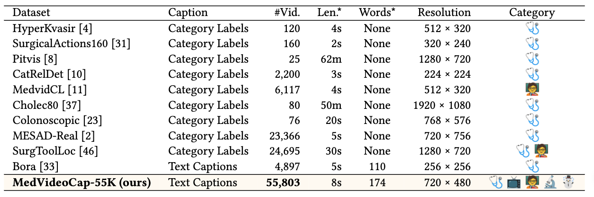

# Unlocking Medical Video Generation by Scaling Granularly-annotated Medical Videos


<p align="center">
[🏠 <a href="https://FreedomIntelligence.github.io/MedGen" target="_blank">Project</a>] ｜ [📃 <a href="https://arxiv.org/" target="_blank">Paper</a>] ｜ [🤗 <a href="https://huggingface.co/datasets/FreedomIntelligence/MedVideoCap-55K" target="_blank">Dataset</a>] 
</p>

## 🛎️ News

* **`April 18, 2025`:** We released our `paper`, `data` and `project`. Models are coming soon. Please stay tuned!


## ⚡ Introduction

Recent advances in video generation have shown remarkable progress in open-domain settings, yet medical video generation remains largely underexplored. Medical videos are critical for applications such as clinical training, education, and simulation, requiring not only high visual fidelity but also strict medical accuracy. However, current models often produce unrealistic or erroneous content when applied to medical prompts, largely due to the lack of large-scale, high-quality datasets tailored to the medical domain. To address this gap, we introduce **MedVideoCap-55K**, the first large-scale, diverse, and caption-rich dataset for medical video generation. It comprises over 55,000 curated clips spanning real-world medical scenarios, providing a strong foundation for training generalist medical video generation models. Built upon this dataset, we develop **MedGen**, which achieves leading performance among open-source models and rivals commercial systems across multiple benchmarks in both visual quality and medical accuracy.
We hope our dataset and model can serve as a valuable resource and help catalyze further research in medical video generation.

> [!NOTE]
> We open-sourced our models, data, and code here.

## 📚 Data

<div align="center">

</div>

You can [⬇️download our full MedVideoCap-55K](https://huggingface.co/datasets/FreedomIntelligence/MedVideoCap-55K) from HuggingFace. Our dataset has several features:

1. **Superior in quantity**. Our dataset comprising 55k medical videos. Supporting video generation across various medical scenarios, it includes medical education, medical imaging, clinical practice, and more. 
2. **Superior in visual quality**. Our dataset is strictly selected from the aspects of aesthetics, temporal consistency, motion smoothness, and clarity assessment. 
3. **Expressive in caption**. Previously proposed medical video datasets typically use category labels as captions. In contrast, our dataset provides expressive and coherent video descriptions with the help of MLLMs.

## 🤩 Acknowledgement

Our works are inspired by the following works.

- [FastVideo](https://github.com/hao-ai-lab/FastVideo): a lightweight framework for accelerating large video diffusion models.
- [VBench](https://github.com/Vchitect/VBench): a comprehensive benchmark suite for video generative models.
- [VideoScore](https://github.com/TIGER-AI-Lab/VideoScore): a automatic metrics to simulate fine-grained human feedback for video generation.


## 📖 Citation
```
coming soon
```
